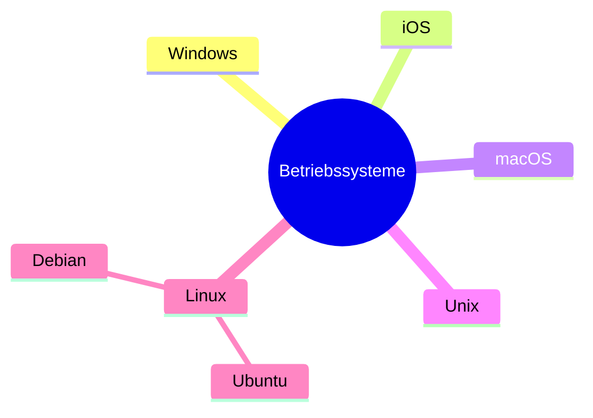

# Mermaid - Diagramme in Markdown

Mermaid ist ein Tool, welches die Möglichkeit bietet verschiedene Diagramme in Markdown zu erstellen.

```mermaid
mindmap
  root((Betriebssysteme))
    Windows
    iOS
    macOS
    Unix
    Linux
      Ubuntu
      Debian
```