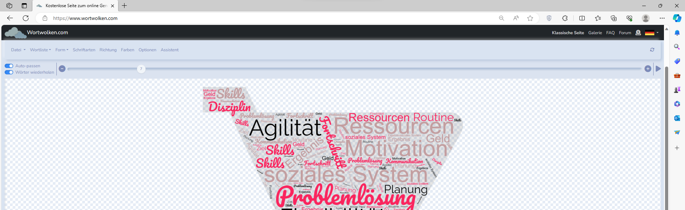

# Allgemeines

## Wortwolken

Wortwolken können einfach unter <https://www.wortwolken.com> erstellt werden. Die eingegebenen Wörter können in einer Vorlage angezeigt (und bei Bedarf verdoppelt) werden.

Zu späteren Wortverarbeitung ist es wichtig, dass die eingegebenen Wörter als `CSV-Datei` gespeichert werden.

[!file](\static\downloads\wordcloud.csv)

## draw.io

`draw.io` erlaubt die einfache und schnelle Gestaltung von Grafiken. Es können verschiedene Diagramme, Flussdiagramme, Netzwerkdiagramme, UML-Diagramme, Oganigramme, Prozesse, We  bdesigns, etc. gestaltet werden.

[draw.io] (/static/images/draw.io.png)

[!file] (/static/downloads/projektmanagementprozess.drawio)

## Mindmap

Mindmaps dienen zur **visuellen Darstellung** eines Themas. Die einzelnen *Knoten* können unter anderem auch dazugehörtige *Unterknoten* aufweisen.

Mit *Kommentaren* oder *Symbolen* können zuzätzliche Informationen aufgezeichnet werden.

Durch die Erstellung einer Mindmap wird das Thema **sehr strukturiert** darstellbar.

[!file](/static/downloads/fahrtenbuch.mm)