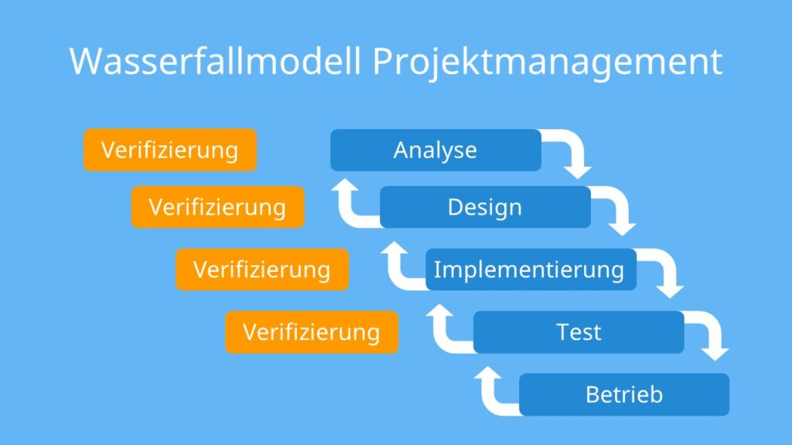

# Wasserfall-Modell

## Allgemeines

Das erste Modell zur profesionellen Erstellung zur Softwareentwicklung ist das Wasserfall-Modell.
Dieses Modell geht von klar abgegrenzten Entwicklungsschritten aus. Das Wasserfall-Modell deckt alle Schritte bis zur Entstehung eines Produktes ab.

In dieser Abbildung ist das **zyklische** Wasserfallmodell ersichtlich. Dies bedeutet, dass in den einzelnen Phasen Feedbacks eingearbeitet werden. Die Software kann dadurch besser an die Kundenwünsche ausgerichtet werden.

- Analyse (es werden die Anforderungen an die Software erstellt, dies bedeutet, dass auch **Lastenhefte und Pflichtenhefte** erstellt werden müssen.)

- Design (in dieser Phase wird das Design der Software erstellt. Hierzu zählt die Erstellung von verschiedenen Diagrammen)

- Implementierung (in dieser Phase wird die Software erstellt)

- Test (die Software wird getestet und die Lauffähigkeit wird überprüft)

- Betrieb/Wartung (dieser Bereich ist ein langfristiger Abschnitt, die Software wird gewartet und angepasst. Auch die Inbetriebname des Kunden geschieht in dieser Phase)

---
date: 2024-09-13
authors:
  - name: David Moser
    email: damoser@schueler.hakzell.at
tags:
  - waterfallmodel
icon: project
order: 90000    
---
 
# Wasserfallmodell
 
## Allgemeines
 
Das erste Modell zur professionellen Software-Entwicklung ist das Wasserfallmodell. Dieses Modell geht von klar abgegrentzten Entwicklungsschritten aus. Das Wasserfallmodell deckt alle Schritte bis zur Entstehung eines Produktes ab.
 

 
Link: [hier klicken](https://studyflix.de/wirtschaft/wasserfallmodell-6748)
 
1. Analyse
 
Es werden die Anforderungen an die Software erstellt. Dies bedeuted das die Begriffe **Lastenhefte** und **Pflichtenhefte** erstellt werden müssen.
 
2. Design
 
In dieser Phase wird das Design der Software erstellt. Hierzu zählt die Erstellung von verschiedenen Diagrammen.
 
3. Implementierung
 
In dieser Phase wird die Software erstellt.
 
4. Test
 
Die Software wird getestet und die Lauffähigkeit wird geprüft.
 
5. Betrieb/Wartung
 
Dieser Bereich ist ein langfristiger Abschnitt. Die Software wird gewartet und angepasst. Auch die Inbetriebnahme der Kunden wird in diesem Bereich zugerechnet. In dieser Abbildung ist das **zyklische Wasserfallmodell** ersichtlich und dies bedeuted, dass in den einzelnen Phasen Feedbacks eingearbeitet werden. Die Software kann dadurch besser an die Kundenwünsche angepasst bzw. ausgerichtet werden.
 
## Analyse
 
In dieser Phase werden die Anforderungen an die Software gesammelt. Dies bedeuted, dass die Kundenwünsche einbezogen werden.
 
In der folgenden Abbildung ist ersichtlich dass die Kosten im späteren Entwicklungsprozess enorm ansteigen[^1].
 

 
Link: [hier klicken](https://www.inflectra.com/Solutions/Methodologies/Waterfall.aspx)
 
In der Analysephase wird versucht, möglichst viel Information von einem Kunden zu erhalten.
 
## Entwurf - Business Design
 
In diesem Bereich wird das Software Design festgelegt - Die Struktur der Software wird geplant. Mit **UML kann in diesem Abschnitt das Klassendiagramm** erstellt werden. Es werden Entscheidungen hinsichtlich Programmiersprache, Frameworks, Klassenbibliotheken etc. getroffen. Es wird festgelegt, wie Komponenten zusammenarbeiten (Schnittstelle). In diesem Sinne wird auch über die Verwendung von Designpatterns nachgedacht (Softwarearchitektur).
 
## Implementierung
 
In dieser Phase wird die Software technisch erstellt. Es wird die GUI, die Geschäftslogik und die Datenservices erstellt.
 
## Test
 
In diesem Abschnitt wird überprüft, ob die Software den Ansprüchen genügt. Nach der erfolgreichen Testphase kann die Software vollständig übergeben werden (Release Candidate). In den App-Stores können für eine geschlossene Benutzergruppe Tests zur Verfügung gestellt werden (Beta Versionen). Apple = Testflight
 
## Wartung
 
Je nach der zu erstellenden Software wird die Wartung unterschiedlich intensiv ausfallen. **Der Umfang der Wartung muss zuvor exakt festgelegt werden.** Die Kosten sind durch diese Festlegung sowohl für das Softwareunternehmen als auch für den Kunden transparent. Eventuell wird eine LTS-Version angeboten.
 
[^1]: Inflectra Corporation. Waterfall & Hybrid Methodologies URL: https://www.inflectra.com/Solutions/Methodologies/Waterfall.aspx, Datum: 16.Sep.2024

Wasserfallmodell • klassisches Projektmanagement · [mit Video]

Wasserfallmodell einfach erklärt ✅ 5 Phasen des Wasserfallmodells ✅ Vor- und Nachteile des klassischen Modells ✅ mit kostenlosem Video
 